# The Minard figure - brought to life

## Overview

Here is an interactive visualisation of Minard's famous map of Napoleon's Russian Campaign, 1812. The presentation is a flow map with continuous bars where width represents troop numbers, oriented perpendicular to the direction of travel.

## Historical Context

### Charles Joseph Minard's Map

Charles Joseph Minard (1781–1870) was a French civil engineer and pioneer in the field of information graphics. His 1869 map of Napoleon's Russian campaign is widely regarded as one of the best statistical graphics ever created. The map elegantly displays six types of information: geography (rivers and cities), the army's direction (advance and retreat paths), the number of troops (bar width), location names, temperature during the retreat, and time (dates).

Edward Tufte, the renowned statistician and information designer, described Minard's map as "probably the best statistical graphic ever drawn" in his book *The Visual Display of Quantitative Information*.

### Napoleon's Russian Campaign, 1812

Napoleon Bonaparte's invasion of Russia in 1812 was one of the most catastrophic military campaigns in history. Beginning on 24 June 1812, Napoleon's Grande Armée crossed the Niemen River with approximately 422,000 soldiers. The campaign saw several major battles including:

- **Battle of Vitebsk** (27–28 July): A French victory that cost significant casualties
- **Battle of Smolensk** (16–18 August): Another French victory, but with heavy losses
- **Battle of Maloyaroslavets** (24 October): A tactical French victory during the retreat
- **Battle of Berezina** (26–29 November): A desperate crossing of the Berezina River during the retreat

Despite reaching Moscow on 14 September 1812, Napoleon found the city largely abandoned and set ablaze. The harsh Russian winter, combined with supply shortages, disease, and constant harassment by Russian forces, decimated the Grande Armée. By the time the remnants of the army crossed back over the Niemen River on 6 December 1812, only approximately 10,000 soldiers remained—a staggering loss of over 97% of the original force.

The campaign marked a turning point in the Napoleonic Wars and contributed significantly to Napoleon's eventual downfall.

## Technical Details

### Implementation

This visualisation recreates Minard's map using Python and matplotlib, bringing the historical data to life through both static and animated representations.

**Key Features:**

- Flow map visualisation with continuous trapezoidal bars representing troop numbers
- Perpendicular bar orientation relative to the direction of travel
- Animated GIF showing Napoleon's progress along the campaign route
- Temperature graph showing the harsh winter conditions during the retreat
- Battle markers indicating key engagements along the route
- Geographic features including major rivers (Niemen, Dnieper, and Berezina)

### Technology Stack

- **Python 3**: Core programming language
- **matplotlib**: Primary plotting and animation library
  - `matplotlib.pyplot`: Plotting functionality
  - `matplotlib.patches`: Custom shapes (Polygon, Circle, Arc, etc.)
  - `matplotlib.animation.FuncAnimation`: Animation support
- **numpy**: Numerical computations for coordinate calculations
- **cartopy** (optional): Geographic projections and map backgrounds
- **imageio** (optional): Enhanced GIF creation support

### Technical Approach

The visualisation uses a custom `draw_flow_segment()` function that creates trapezoidal polygons perpendicular to the direction of travel. Each segment's width is proportional to the number of troops at that point, creating a smooth, continuous flow map.

**Key Algorithms:**

- **Flow segment calculation**: Uses vector mathematics to calculate perpendicular offsets for bar width
- **Coordinate interpolation**: Smooth animation between waypoints using linear interpolation
- **Scale factor calculation**: Dynamically scales troop numbers to visual width in degrees

The animation features a caricature of Napoleon that moves along the route, with different expressions for the advance (confident) and retreat (sad) phases. The animation consists of 400 frames rendered at 10 frames per second.

### Output Files

- `minard_plot.png`: High-resolution static image (300 DPI)
- `minard_animation.gif`: Animated GIF showing Napoleon's journey (400 frames, 10 fps)


- `minard.mmd`: Mermaid diagram file representing the campaign flow

### Mermaid Visualisation

In addition to the Python-generated visualisations, this project includes a [Mermaid](https://mermaid.live) diagram file (`minard.mmd`) that provides an alternative flowchart representation of Napoleon's campaign.

**What is Mermaid?**

Mermaid is a text-based diagramming and charting tool that allows you to create diagrams using simple markdown-like syntax. It supports a wide variety of diagram types including flowcharts, sequence diagrams, Gantt charts, and more. Mermaid diagrams can be rendered in many platforms including GitHub, GitLab, documentation sites, and the [Mermaid Live Editor](https://mermaid.live).

The `minard.mmd` file contains a flowchart visualisation that shows:

- The advance path from Kowno to Moscow with troop numbers at each location
- The retreat path from Moscow back to Kowno, showing the devastating troop losses
- Temperature data during the retreat phase
- Geographic coordinates and dates for key waypoints
- Visual styling that matches the original Minard colour scheme (beige for advance, dark for retreat)

You can view and edit the Mermaid diagram by:

1. Opening the file in the [Mermaid Live Editor](https://mermaid.live)
2. Copying the contents of `minard.mmd` and pasting it into the editor
3. The diagram will render automatically, and you can export it as PNG or SVG

The Mermaid diagram file can be viewed directly in GitHub: [minard.mmd](minard.mmd). It can also be viewed and edited using the [Mermaid Live Editor](https://mermaid.live).

The diagram is also embedded below and will render directly in GitHub:

```mermaid
%%{init: {'theme':'base', 'themeVariables': { 'primaryColor':'#d63384','primaryTextColor':'#fff','primaryBorderColor':'#a61e4d','lineColor':'#495057','secondaryColor':'#0d6efd','tertiaryColor':'#ffc107'}}}%%
flowchart TB
    %% Minard's Map of Napoleon's Russian Campaign, 1812
    %% Nodes positioned based on geographic coordinates (Latitude, Longitude)
    %% Layout: West (left) to East (right) based on longitude
    %% North-South positioning based on latitude (higher lat = higher position)
    
    %% ADVANCE PATH - West to East, positioned by coordinates
    %% Longitude range: 24.0°E (Kowno) to 37.6°E (Moscow)
    %% Latitude range: 54.7°N (Wilna) to 55.8°N (Moscow)
    
    subgraph Row1[" "]
        direction LR
        Kowno["Kowno (Kaunas)<br/>54.9°N, 24.0°E<br/>June 24, 1812<br/>422,000 men"]
        Wilna1["Wilna (Vilnius)<br/>54.7°N, 25.3°E<br/>400,000 men"]
        Witebsk["Witebsk (Vitebsk)<br/>55.2°N, 30.2°E<br/>175,000 men"]
        Smolensk1["Smolensk<br/>54.8°N, 32.0°E<br/>145,000 men"]
        Dorogobouge["Dorogobouge (Dorogobuzh)<br/>54.9°N, 33.2°E<br/>127,000 men"]
        Moscou["Moscou (Moscow)<br/>55.8°N, 37.6°E<br/>Sept 14, 1812<br/>100,000 men"]
    end
    
    %% RETREAT PATH - East to West, positioned below advance to show different route
    %% More southerly route in places (lower latitudes)
    
    subgraph Row2[" "]
        direction LR
        Malo["Malo-Jaroslavetz<br/>(Maloyaroslavets)<br/>~55.0°N, 36.5°E<br/>96,000 men"]
        Mojaisk["Mojaisk (Mozhaysk)<br/>~55.5°N, 36.0°E<br/>87,000 men"]
        Smolensk2["Smolensk<br/>54.8°N, 32.0°E<br/>50,000 men"]
        Orscha["Orscha (Orsha)<br/>~54.5°N, 30.4°E<br/>37,000 men"]
        Studienska["Studienska (Studenka)<br/>~54.4°N, 30.0°E<br/>24,000 men"]
        Minsk["Minsk<br/>~53.9°N, 27.6°E<br/>20,000 men"]
        Wilna2["Wilna (Vilnius)<br/>54.7°N, 25.3°E<br/>12,000 men"]
        Kowno2["Kowno (Kaunas)<br/>54.9°N, 24.0°E<br/>Dec 6, 1812<br/>10,000 men"]
    end
    
    %% Temperature timeline
    subgraph TempRow[" "]
        direction LR
        T1["Oct 18<br/>0°C"]
        T2["Nov 9<br/>-9°C"]
        T3["Nov 14<br/>-21°C"]
        T4["Nov 28<br/>-26°C"]
        T5["Dec 7<br/>-30°C"]
    end
    
    %% ADVANCE PATH - following geographic route (West to East)
    %% Flow direction matches actual geographic movement
    Kowno -->|"Advance<br/>East (25.3°E)"| Wilna1
    Wilna1 -->|"Advance<br/>Northeast (30.2°E)"| Witebsk
    Witebsk -->|"Advance<br/>Southeast (32.0°E)"| Smolensk1
    Smolensk1 -->|"Advance<br/>East (33.2°E)"| Dorogobouge
    Dorogobouge -->|"Advance<br/>Northeast (37.6°E)"| Moscou
    
    %% RETREAT PATH - following geographic route (East to West, more southerly)
    %% Shows the different return route with lower latitudes in places
    Moscou -->|"Retreat<br/>Southwest (36.5°E)"| Malo
    Malo -->|"Retreat<br/>Northwest (36.0°E)"| Mojaisk
    Mojaisk -->|"Retreat<br/>West (32.0°E)"| Smolensk2
    Smolensk2 -->|"Retreat<br/>Southwest (30.4°E)"| Orscha
    Orscha -->|"Retreat<br/>Southwest (30.0°E)"| Studienska
    Studienska -->|"Retreat<br/>Southwest (27.6°E)"| Minsk
    Minsk -->|"Retreat<br/>Northwest (25.3°E)"| Wilna2
    Wilna2 -->|"Retreat<br/>Northwest (24.0°E)"| Kowno2
    
    %% Temperature timeline
    T1 --> T2 --> T3 --> T4 --> T5
    
    %% Link temperature to locations (dashed lines showing correlation)
    Moscou -.->|"Oct 18"| T1
    Mojaisk -.->|"Nov 9"| T2
    Smolensk2 -.->|"Nov 14"| T3
    Studienska -.->|"Nov 28"| T4
    Kowno2 -.->|"Dec 7"| T5
    
    %% Styling - Advance in beige/tan (original colour), Retreat in black/dark
    classDef advancePath fill:#d4a574,stroke:#8b6914,stroke-width:5px,color:#000
    classDef retreatPath fill:#2c3e50,stroke:#1a252f,stroke-width:3px,color:#fff
    classDef tempData fill:#e3f2fd,stroke:#1976d2,stroke-width:2px,color:#000
    
    class Kowno,Wilna1,Witebsk,Smolensk1,Dorogobouge,Moscou advancePath
    class Malo,Mojaisk,Smolensk2,Orscha,Studienska,Minsk,Wilna2,Kowno2 retreatPath
    class T1,T2,T3,T4,T5 tempData
```



This provides a complementary view of the campaign data that emphasises the flow and sequence of events, making it easy to understand the progression of the campaign and the relationship between locations, troop numbers, and temperature.

### Dependencies

**Required:**

```bash
pip install matplotlib numpy
```

**Optional (for enhanced features):**

```bash
pip install cartopy  # For geographic map backgrounds
pip install imageio  # For improved GIF creation
```

## Usage

Run the script to generate both static and animated visualisations:

```bash
python plot_minard.py
```

The script will generate `minard_plot.png` and `minard_animation.gif` in the current directory.

## License

This project is for educational purposes. Please ensure you have appropriate permissions for any external data sources used.

## Author

**S. Hallett**  
Course: MK:U, Big Data and Visualisation  
Date: 23/11/2025

---

*This project uses UK spelling conventions throughout and follows PEP 8 coding standards for Python code.*
